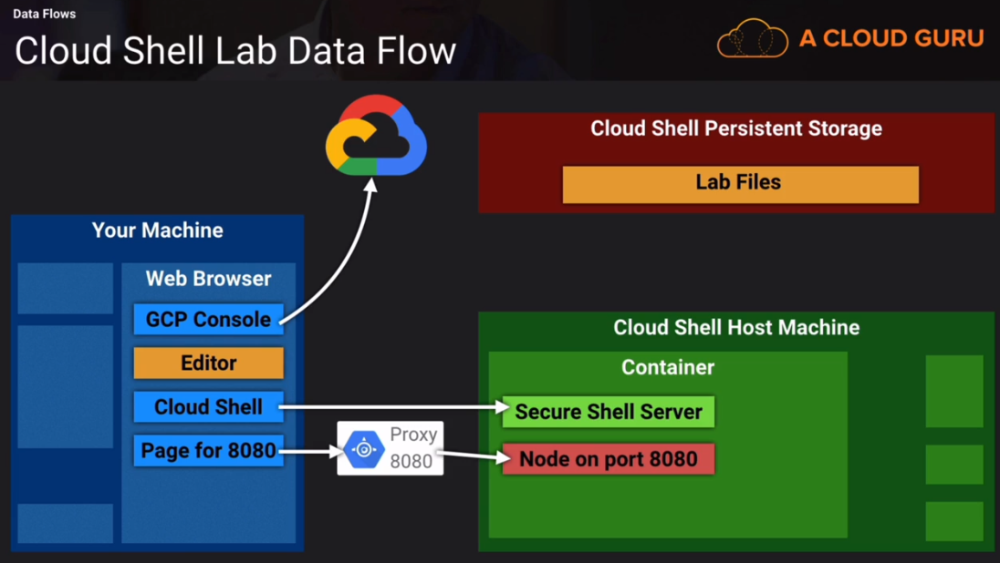
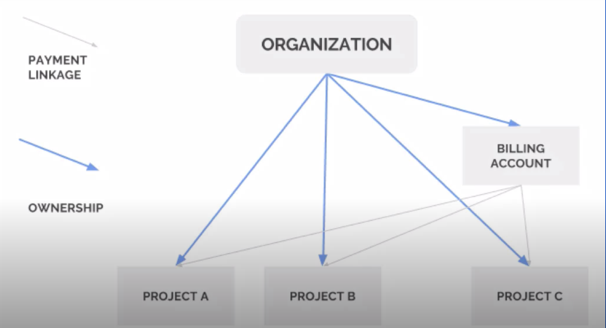

 # GCP Google Certified Associate Cloud Engineer 

 

## Navigation 

- [Summary](#Summary)  
- [Exam Domains](#Exam-Domains)   
- [Account Setup](#Account-Setup)  
- [Shell Overview](#Shell)
	- [Global Flags and setting](#Global-Flags-and-setting)  
	- [Cloudshell Commands](#Cloudshell-Commands)  
	- [GSUTIL Global Storage](#GSUTIL-Global-Storage)	
	- [Configurations](#Configurations)
- [Compute](#Compute)  
	- [looking at ssh](#Looking-at-the-SSH)
	- [MetaData](#MetaData)
- [Data Flows](#Data-Flows)  
- [Scaling](#Scaling)
- [Security](#Security)  
	-[Permissions](#Permissions)
	- [Roles](#Roles)
	- [IAM Overview](#IAM-Overview)
	- [Members](#Members)
	- [Group](#Group)
	- [Policies](#Policies)
- [IAM Overview](#IAM-Overview)  
- [Billing Access Control](#Billing-Access-Control)
- [Challenges](#Challenges)  

## Summary

GCP ACE is similar but slightly harder than the AWS SysOps (the hardest of the AWS associate exams).    
  
**TIPS**  
  
- Always plan something through before building it out - do a high level flow on paper.  
- Read and learn different roles and permission types.  

  
### Google Job Role Description for ACE 
  
An Associate Cloud Engineer deploys applications, monitors operations of multiple projects, and maintains enterprise solutions to ensure that they meet target performance metrics. This individual has experience working with public clouds and on-premises solutions. They are able to use Google Cloud Console and the command-line interface to perform common platform-based tasks to maintain one or more deployed solutions that leverage Google-managed or self-managed services on Google Cloud.  
  

- Deploys applications  
- Monitors operations of multiple projects  
- Maintains enterprise solutions to ensure they meet target performance metrics  
- Experience working with public cloud and on-prem solutions.  
- Able to use google cloud console and CLI  
- Performs common platform-based tasks   
- Leverages google-managed or self-managed services on google cloud.  


# Exam Domains   
  
[Navigation](#Navigation)   
  
 
1. Setting up a cloud solution environment  
2. Planning and configuring a cloud solution.  
3. Deploying an implementing a cloud solution.  
4. Ensuring succesful operation of a cloud solution.  
5. Configuring access and security.  

  

## In detail 
 
Go [here](https://cloud.google.com/certification/guides/cloud-engineer)

1.1 Setting up cloud projects and accounts.  
1.2 Managing billing configuration  
1.3 Installing and configuring the command line interface (CLI)  
    
2.1 Planning and estimating GCP product use using the Pricing Calculator  
2.2 Planning and configuring compute resources.   
2.3 Planning and configuring data storage options    
2.4 Planning and configuring network resources.   
  
3.1 Deploying and implementing Compute Engine resources  
3.2 Deploying and implementing Google Kubernetes Engine resources  
3.3 Deploying and implementing App Engine, Cloud Run, and Cloud Functions resources.  
3.4 Deploying and implementing data solutions.   
3.5 Deploying and implementing networking resources.  
3.6 Deploying a solution using Cloud Marketplace  
3.7 Deploying application infrastructure using Cloud Deployment Manager  
  

4.1 Managing Compute Engine resources  
4.2 Managing Google Kubernetes Engine resources  
4.3 Managing App Engine and Cloud Run resources  
4.4 Managing storage and database solutions  
4.5 Managing networking resources  
4.6 Monitoring and logging  
  

5.1 Managing identity and access management (IAM).  
5.2 Managing service accounts.   
5.3 Viewing audit logs for project and managed services.  
  

## GOOGLE CHEAT SHEET 
  
[Navigation](#Navigation)   
  

  
  
  

# Account Setup  
  
**LEAST PRIVILEGE**  

- Create a new account for billing
- secure with 2fa
- Forward mail to normal account   
- Admin account for billing rarely needed.  

1. Go incognito.  
2. Go to google free trial.  
3. create account.  
4. Setup 2FA
5. Set up mail forwarding   
  

`https://console.cloud.google.com`  
  
Projects have:  
  
- Names  
- Project Id  
- Project Number  
- State (active)


# Creating a User Account   

  
For free tier,  

1. Go to billing   
2. Go to account settings/management 
3. Add user (billing user )  
4. Select another account - when that account creates a new project it will be linked.  
  


# Shell   
  
[Navigation](#Navigation)  
  

- Persistent 5gb volume  but VM is ephemeral (reset 20 mins after session end.)    
- `dl file` to doownload a file.    
- You can run a server and view it by using the port utility top right hand side.     
- SDK opens in new window.    
      
  
`gcloud <global flags> <service/product> <group/area> <command> <flags> <parameters>`    


To be extra safe specifiy project name every time:  
  
`gcloud --project myprojectID compute instances list`  
    

## Global Flags and setting
  
  
[Navigation](#Navigation)  
  


`--help`  
`-h`  
`--project <projectID>`  
`--account <Account> `  
`--filter 
   similar to grep`  
```
-format <can choose JSON,CSV,YAML etc>  
     can pipe JSON to "jq"  command for further processing.  
```  
`--quiet (or -q)`  Ignore promts, good for scripts    
  

Always set values using set, i.e. `gcloud config set <property>  <value>  `  

`gcloud config set project` is same as (and replaces)  `--project myproject`  
 
`gcloud config set compute/region`  to replace `--region myregion`  
**note we need to say compute and region**  
  
**get**  `gcloud config get <property> <value>  `  
**set**  `gcloud config set <property> <value>  `  
**Unset** `gcloud config unset <property> `  
  
## Cloudshell Commands
    

[Navigation](#Navigation)  
  

## General  

| cloudshell      | command           | 
| ------------- |:-------------| 
| `gcloud projects list`  |  list projects| 
| `gcloud config set project` |   set project |
| `gcloud projects describe` |  project info|
| `gcloud config list`  | showconfig |
| `gcloud components install` | Install specific components|
| `gcloud info`  | show current env details |
| `gcloud config set`| Define a property (like compute/zone) for the current configuration|
| `gcloud config list`|Display all the properties for the current configuration.|
      
  
## Services   
    
| cloudshell      | command           | 
| ------------- |:-------------| 
| `gcloud services enable compute.googleapis.com`| enable a service | 
| `gcloud services list`| list available services |
| `gcloud services list --enabled`| list enabled services |
| `gcloud services list --available`| list available services |
| `gcloud services list --available pipe	 grep compute`| list check if compute is in available services|  
  

  
## Identity & Access Management
  
| command      | description           |  
| :------------- |:-------------| 
|`gcloud iam list-grantable-roles`| List IAM grantable roles for a resource.|
|`gcloud iam roles create`| Create a custom role for a project or org.|
|`gcloud iam service-accounts create`| Create a service account for a project.|
|`gcloud iam service-accounts add-iam-policy-binding`| Add an IAM policy binding to a service account.|
|`gcloud iam service-accounts set-iam-policy-binding`| Replace existing IAM policy binding.|
|`gcloud iam service-accounts keys list`| List a service account's keys.|   
  
## Docker and GKE  
  
| command      | description           |  
| :------------- |:-------------|   
|`gcloud auth configure-docker`| Register the gcloud tool as a Docker credential helper.| 
|`gcloud container clusters create`| Create a cluster to run GKE containers. | 
|`gcloud container clusters list`| List clusters for running GKE containers. | 
|`gcloud container clusters get-credentials`| Update kubeconfig to get kubectl to use a GKE cluster.| 
|`gcloud container images list-tags`| List tag and digest metadata for a container image.| 
  
    
## COMPUTE & VMs 
    
- Creating compute will create users, service account  

### Instances   

| command      | description           |  
| :------------- |:-------------|    
|`gcloud compute instances list`|  List all VM instances in a project.|  
|`gcloud compute instances describe`|  Display a VM instance's details.|  
|`gcloud compute instances create adamsvm`| create a vm, you can specify region too| 
|`gcloud compute instances delete adamsvm`| delete a vm|   


    
| command      | description           | 
| :------------- |:-------------|     
|`gcloud compute zones list`|  List Compute Engine zones.|
|`gcloud compute disks snapshot`|  Create snapshot of persistent disks.|
|`gcloud compute snapshots describe`|  Display a snapshot's details.|
|`gcloud compute snapshots delete`|  Delete a snapshot.|
|`gcloud compute ssh`|  Connect to a VM instance by using SSH.  |
  


    

  


## GSUTIL Global Storage

  
[Navigation](#Navigation)  
  

  
[creatingBuckets](https://cloud.google.com/storage/docs/creating-buckets#storage-create-bucket-gsutil)  
[storageLocations](https://cloud.google.com/storage/docs/locations)   
  

`ch` means change  
`**` means all but as flat hiearchy  
`acl` means access control list  


| command      | description           |  
| :------------- |:-------------|    
|`gsutil ls`|  List buckets|  
| `gsutil ls gs://my-bucket`   | list bucket contents |
| `gsutil ls -a gs://my-bucket`   | list bucket archive info |   
|`gsutil ls bucket/** `| list everything |  
|`gsutil mb `| make bucket|  
|`gsutil mb --help`| make bucket help  |  
|`gsutil mb -l EUROPE-WEST2 gs://mcmurchie_london_bucket` | create bucket in london with name|  
| `gsutil cp Desktop/kitten.png gs://my-awesome-bucket`   | copy file into bucket  |
| `gsutil cp -r x y `   | copy recursively |
| `gsutil cp x/** y `   | copy all contents to root as flat |
| `gsutil ls -l gs://my-awesome-bucket/kitten.png`   |  list bucket conent details |  
|`gsutil label get gs://mcmurchies_london_bucket1` | get **labels** for bucket |  
|`gsutil label set mylabelsfile.json gs://my_bucket/` | set label on bucket from file |   
|`gsutil label ch -l "function:learning" gs://my-bucket/` | append label to bucket|
|`gsutil versioning get gs://my-bucket` | get bucket version|
|`gsutil versioning set on gs://my-bucket` | Enable Bucket Versioning|    
|`gsutil acl ch -u AllUsers:R gs://my-bucket/stuff.jpg`| change permisions|  
  

## Configurations
    
  
[Navigation](#Navigation)  
  
  
**RULE OF THUMNB**  
  
1. Make a new configuration  `gcloud config configurations create newconfig`  
2. Switch to it   `gcloud config configurations activate newconfig`  
3. List contents `gcloud config list`   
4. List other non active configs  `gcloud --configuration=newconfig config list`  or `gcloud config configuration describe newconfig`  

Start with :   
`gcloud init`  
    

- Maintains a group of settings to let you switch between.  
- Great for multiple projects  
- List all config properties `gcloud config list`  
- Different from listing all the configurations `gcloud config configurations list`   
  - `IS_ACTIVE` will tell you which ones you are using.  
  - Other columns list account, project, region, zone and the name of the config.
    
**get**  `gcloud config get <property> <value>  `  
**set**  `gcloud config set <property> <value>  `  
**Unset** `gcloud config unset <property> `  
  
| command      | description           |  
| :------------- |:-------------|    
|`gcloud config configurations create ITS_NAME` | Create a gcloud configuration|
|`gcloudconfig configurations activate ITS_NAME`| Activate config|  
|`run_my_command --configuration=ITS_NAME`| To run a single command with a specific config|  
|`gcloud init`| set up your config |  
|`gcloud config list`|  List all config properties|   
|`gcloud config configurations list`| List which ones you are using|
  
  

# Compute    
  
[Navigation](#Navigation)   
  

  
## Steps to set up   

Open Shell   
run `gcloud config list`   
run `ls -a` to check for hidden directories.   
`whoami`  
`hostname`  
`curl api.ipify.org`  check which IP i appear to be connecting from.  
`gcloud compute instances list`  
  
`gcloud compute instances create myhappyvm -h`	  get help on creating compute    
Note default is **n1-standard-1**  

## Run a free machine  
  
`gcloud compute machine-types list`	  list too big, so lets filter  
`gcloud compute machine-types list --filter="NAME:f1-micro"`  Still a bit too big.  
  
Note free is only available in us-west  
 
`gcloud compute machine-types list --filter="NAME:f1-micro AND ZONE~us-west"`    
  
**set default for free**  
  
`gcloud config set compute/zone us-west2-b`
`gcloud config set compute/region us-west2`
    

`gcloud compute instances create --machine-type=f1-micro murchievm`  
    
## TL:DR  
  

```
gcloud compute instances create my-lovelyVM --zone=us-west2-b --machine-type=f1-micro
```
  
  
**OUTPUT**  
```
Created [https://www.googleapis.com/compute/v1/projects/myuserproject-299719/zones/us-west2-b/instances/murchievm].
NAME       ZONE        MACHINE_TYPE  PREEMPTIBLE  INTERNAL_IP  EXTERNAL_IP    STATUS
murchievm  us-west2-b  f1-micro                   10.168.0.2   35.235.109.34  RUNNING
```  


Connect by using external IP address (name and internal not sufficient)  
  
`ping -c 3 35.235.109.34`  
  
  
## Steps to connect  
  
`gcloud compute ssh murchievm`  
  
*note* if we run ssh ipaddress it will fail, because we have no keys. But blueprint will be added.  
  
Give it a seed for password (it sets up a keychain)    
  
- whoamai is same
- curl api.ipify.org will give similar addresses between shell and compute   
  

### Looking at the SSH
   
  
[Navigation](#Navigation)   
  


Outside SSH in our shell terminal.  
```
cd .ssh  
ls  
cat google_compute_engine.pub  
  
``` 
  
**private key**  
  
By heading the google_compute_engine file  
  
`head -n 10 google_compute_engine`  
    
 Public key in authorized keys (.ssh) inside the VM should be the same, because: 

- public key says who we are.    
    
## MetaData
  

[Navigation](#Navigation)   
  


**Avdanced options** if you want to set metadata in console when creating a VM.  
Note the key:value for storage, needs the gs:// prefex.   
    
Continuing on from earlier:  

run inside vm  

`curl metadata.google.internal/computeMetadata/v1/`    
  
will get an error to add a header:  

`curl -H "Metadata-Flavor:Google" metadata.google.internal/computeMetadata/v1/project/ `
    
  
**output**   

```
instance/
oslogin/
project/
```  
  
To drill down...  
  
```
curl -H "Metadata-Flavor:Google" metadata.google.internal/computeMetadata/v1/project/ 
```  
  
If we go deep enough we can find the public key, so this is how the info was passed in.  
  
You can get instance name, service account defaults, token for api requests.  
  
we can run `gcloud config list`  
    
so we have access to cloud resources , such as buckets using `gsutil`  
  


You can't delete the VM from inside the VM.  
  
    
  

**GCE Control Plane**  
  

Hypervisor will see CPU, Disk and network access of virtual machine   
  
OS level wont be visible (memory, garbage collection in jvm)  
  
once set up, the control plane outage wouldn't affect the VMs as they have the orders already  
  
this is why if outage you may not be able to delete, stop , start but it will still be fine.  
  
**metadata service**  
  
The VM communicates with metadata service on the host machine (all VMs will look at metadataservice)  
It grabs what it needs to get started.  
SSH keys has a watch on the service to get the keys from metadata
OSBoot and startupscripts get info from metadata too.  

**syslog** and **stackdriver**  
    
os info  
Stackdriver will forward these logs.   
Stackdriver will also forward logs the hypervisor can't see such as memory and other metrics.  
  

  

  
  


# Data Flows   
  
[Navigation](#Navigation)   
  
  

Data flow thinking is very important in this course.  
  
**Mental Model** you remember something by understanding it.   
  

- MOVING -------- NETWORK  
- PROCESSING -------- COMPUTE  
- REMEMBERING -------- STORAGE  
   
This is a general appraoch.  

Systems combine   
  
- Build largers systems from smaller ones   (abstractions useful)
- zoom in and out    
  

Example for cloud lab  
  
    
  


 
# Scaling
  
  
[Navigation](#Navigation)   
    
- Instance templates(like AMIs) are useful than manually creating everytime  
- Managed instance groups better than unamanged because less restrictions  
   
   
[MIGS and instance grous](http://cloud.google.com/compute/docs/instance-groups)  
[Autoscaling groups of instances](https://cloud.google.com/compute/docs/autoscaler/)  
  

# Security  
  
  
[Navigation](#Navigation)   
   
  
## Permissions
  
Follows form of *service.resource.verb*  
  
Usually correspends to the rest API.  
  
Examples:  
  
`pubsub.subscriptions.consume`  
  
`pubsub.topics.publish`    
  

  
  
## Roles
    
  
[Navigation](#Navigation)   
   
  
- Collection of permissions 
- **Primative roles** (often too broad defined at project level)
	- Viewer **role** is read only  
	 - Editor **role** can view and change
	 - Owner **role** can also controll acces & billing   
- **predefined roles** -- gives you granular control and Access  
	eg. roles/bigquery.dataeditor, roles/pubsub.subscriber  

  
| Role      | description           |  
| :------------- |:-------------|    
|`roles/appengine.appAdmin`|  Admin - read,write, modify|  
|`roles/appengine.serviceAdmin`| RO for app config/settings, Write to module level and version settings, can't deploy new ver| 
|`roles/appengine.deployer`| RO access app config/settings,WO create new ver, can't mod existing vers, only delete no traffic ones| 
|`roles/appengine.appViewer`|RO access app config/settigs|
|`roles/appengine.codeViewer`|RO access app config/settings/deployed source| 
  
   
    
## IAM Overview

  
[Navigation](#Navigation)   
   
        
  

[using IAM securely](https://cloud.google.com/iam/docs/using-iam-securely)  
[IAM FAQ](https://cloud.google.com/iam/docs/faq)   

    
### Members
    
[Navigation](#Navigation)   
   
    
- `users` , `service-accounts`, `groups` or `domain`  
- `Group` should be default for best practice.  
- It is a known google identity  
- Each has a gmail account  
- Can Be:
	- **user:** specific google account
	- G Suite, Cloud identity, gmail, or Validated email.  
	- **Service account** for apps and services  
	- **group** of users and service accounts. Mix and match (you can give a group of developers access instead of each one.) 
	- **domain** whole domain managed by G-Suite or google identity  
	- **allAuthenticatedUsers** i.e. it is public, any google account needed.  
	- **allUsers** public and no account needed.  

### Group  
  
**group** of users and service accounts.  

- Mix and match.  
- Every group has an email address.  
    
Examples: developers@mycompany.com  
  
- Don't use the email to log in.   
- Use group for **EVERYTHING**   
  
Groups can even be used to manage a project within an organisation.    
To manage the groups in an org, you can nest them such as  :  
  
All staff Group, includes all sub groups.    
Engineer group includes developer group and devops group.  
  

### Policies
  

Resources, roles and members are tied in via a policy.  
  
- A policy binds members to roles for some scope of resources.  
- Answers: **who can do what to which thing(s)**  
- Attached to some level in resource hierarchy 
	- Organisation, folder, project, resource  
- Roles and members listed in policy, but resource identified by attachment. 
- **Allow only** you can never deny someone/something with a policy.  
- Child policy can't restrict access granted at a higher level.  
- This is why you need to be careful, use folders and plan it.  
  
#### Policy example    
    
[link](https://cloud.google.com/iam/docs/granting-changing-revoking-access)  
  

- Has two bindings 
- first part (owner) means he is owner for anything he is attached to.  
- attaching to a folder that contains a lot of projects gives bob a lot of power. 
- but to one small resource is much less power.  

- Second binding, grants compute network viewer role to a bunch of members, user, group, domain and service account.  
- regardless of which project is using the service account.  
  

- One policy per resource  
- **USE GROUPS INSTEAD** of members.  


```json  

{
	"bindings":[
		{
			"role": "roles/owner",
			"members": ["user:bob@example.com"]
		},
		{
			"role": "roles/compute.networkViewer",
			"members": [
				"user:alice@example.com",
				"group:admins@example.com",
				"domain.example2.com",
				"serviceAccount:my-other-app@appspot.gserviceaccount.com"


			]
		}

	]

}


```
  
- Takes 60 second to 7 mins to propogate.  
  
### Managing Polciy Bindings  
  
you could get and set iam policy  
  
`get-iam-policy`  edit the JSON/YAML
`set-iam-policy`  
  
**Dont** do this - in general use the following:  
  
`add-iam-policy-binding` and `remove-iam-policy-binding`  
  

**example**  
  
```shell
gcloud [GROUP] add-iam-policy-binding [RESOURCE-NAME] --role [ROLE-ID-TO-GRANT] --member user:[USER-EMAIL]
```
  
```shell
gcloud [GROUP] remove-iam-policy-binding [RESOURCE-NAME] --role [ROLE-ID-TO-GRANT] --member user:[USER-EMAIL]
```
  
  
- These are atomic operations 
- Fine grain and easier to control.  
- Avoid race condition - can happen similtaneously  
  
For example, if two people do a get and set on the iam policy then only one of them will win to make the change.  
Also Get and set can be sending a lot of info, and take a long time to process.  
  
Another example:  
  
```  
gcloud compute instances add-iam-policy-binding myhappyvm --role roles/compute.instanceAdmin
-- member user:murchie85@gmail.com  

```  
    
  
# Billing Access Control  
  
    
[Navigation](#Navigation)   
     
  
    


- Type of resource living outside of project.  
- Can belong to an org
	- inherits org-level IAM policies.  
- Can be linked to projects  
	- Doesn't own the project or affect it.  

**A single project only has a single billing account**  
But billing account can be tied to many.  
  

**billing account user**  
  
The purpose is to link projects to billing accounts.  
**Level**: **organisation** or **billing account**  
  
This role has restricted permissions (so can grant broadly)  
Typically in combination with project creator.    

These two roles allow a user to create new projects linked to a billing account on which the role is granted.  
  
### Billing Roles  
  

| Role      | purpose           |  Scope |
| :------------- |:-------------|:-------------| 
|`billing account creator`|  create new billing accounts| org |  
|`billing account administrator`|manage but not create| billing account |  
|`billing account user`|link projects to billing accounts | billing account| 
|`billing account viewer`| View billing acc cost info and transactions | billing accounts|  
|`project billing manager`| link/unlink project from a billing account| project|   


# Challenges  
    
[Navigation](#Navigation)   
  
    
## First Challenge  
  
**Requirements**   
  
1. Create a brand new project 
2. GCE instance to run a script [here](https://raw.githubusercontent.com/ACloudGuru/gcp-cloud-engineer/master/compute-labs/worker-startup-script.sh)  
3. Script below, It installs stackdriver  
4. Create a new bucket  
5. Log file should land in the bucket (in the script)  
  
Try to do this all via script as stretch goal.  

```shell 
#! /bin/bash

#
# Echo commands as they are run, to make debugging easier.
# GCE startup script output shows up in "/var/log/syslog" .
#
set -x


#
# Stop apt-get calls from trying to bring up UI.
#
export DEBIAN_FRONTEND=noninteractive


#
# Make sure installed packages are up to date with all security patches.
#
apt-get -yq update
apt-get -yq upgrade


#
# Install Google's Stackdriver logging agent, as per
# https://cloud.google.com/logging/docs/agent/installation
#
curl -sSO https://dl.google.com/cloudagents/install-logging-agent.sh
bash install-logging-agent.sh


#
# Install and run the "stress" tool to max the CPU load for a while.
#
apt-get -yq install stress
stress -c 8 -t 120


#
# Report that we're done.
#

# Metadata should be set in the "lab-logs-bucket" attribute using the "gs://mybucketname/" format.
log_bucket_metadata_name=lab-logs-bucket
log_bucket_metadata_url="http://metadata.google.internal/computeMetadata/v1/instance/attributes/${log_bucket_metadata_name}"
worker_log_bucket=$(curl -H "Metadata-Flavor: Google" "${log_bucket_metadata_url}")

# We write a file named after this machine.
worker_log_file="machine-$(hostname)-finished.txt"
echo "Phew!  Work completed at $(date)" >"${worker_log_file}"

# And we copy that file to the bucket specified in the metadata.
echo "Copying the log file to the bucket..."
gsutil cp "${worker_log_file}" "${worker_log_bucket}"
```
